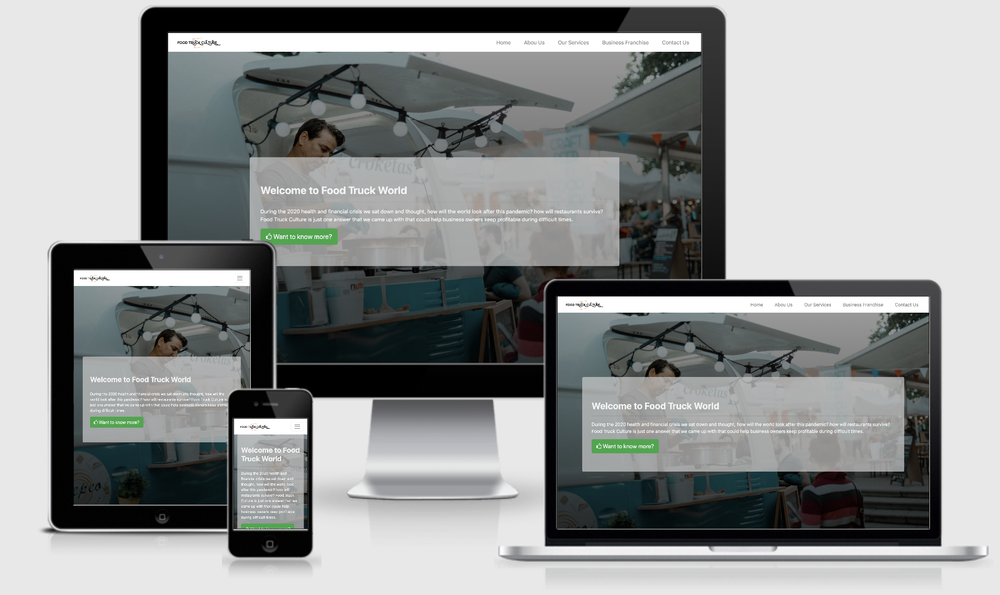
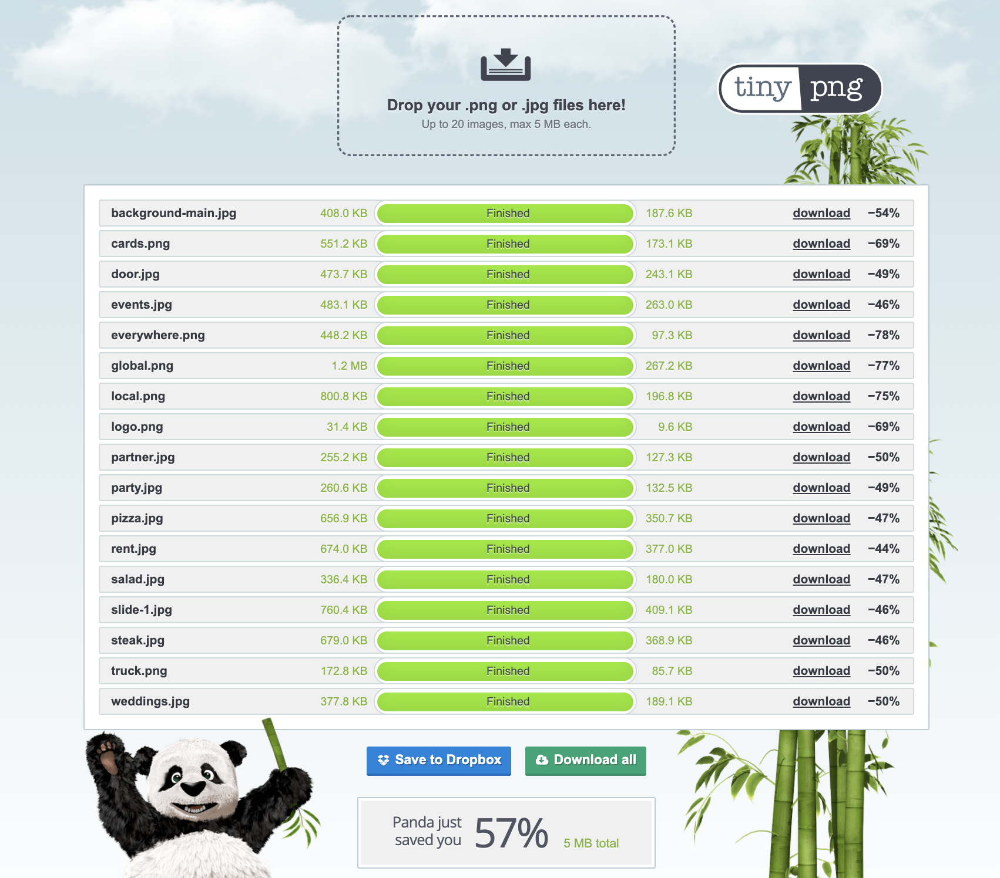
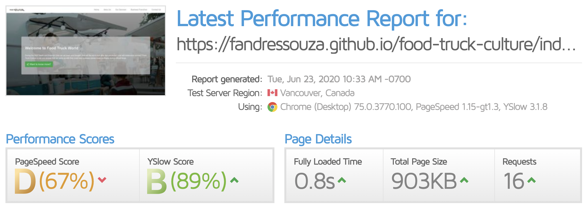

  

# Description

Food truck culture is all about food delivered at your doorstep! We especialize in food truck rentals and provide a wide array of services for any pocket.

We have developed a business from the ground up which has been serving our community for over 10 years and has won several awards like the **International Food Truck Club** Award which takes place in Venice Beach, California.

# Deployment and Demo

Website has been deployed to [GitHub Pages](https://fandressouza.github.io/food-truck-culture/).

# Wireframe

The wireframe was designed using [Balsamiq](https://balsamiq.com/wireframes/) and links to the final version can be found below:

- [Wireframe Final Version]()

# UX

In order to improve user experience and website loading speed, I have compressed the images using [tinypng.com](https://tinypng.com/) and the reduction in image size has been 57%.

# Visual Identity

- [Logo Pony](https://www.logopony.com/) for the logo design and stationary
- [Bootswatch](https://bootswatch.com/) themes to add extra sweetness

# User Stories

Users:

- As a user, I'd like to rent a food truck for an event
- As a user, I'd like to contact the company to help me start my business
- As a user, I'd like to see who are the leaders of the company
- As a user, I'd like to sign up as a franchise owner for the company

Food truck owners:

- As a business owner, I'd like to list my services in the site
- As a business owner, I'd like to receive legal advice on certain issues
- As a business owner, I'd like to access the members area
- As a business owner, I'd like to connect with other businesses in my area

# Features

# Testing

Website has been tested using [GTmetrix](https://gtmetrix.com/reports/fandressouza.github.io/7xHu6MBv) and [BrowserStack](), see results below:

The points below can be improved with a bit more optimization:

- Serving scaled images (some images are being resized in CSS e.g. logo.png)
- Leveraging browser caching
- When I did this test, css/theme.css returned a 404 (Imispelled Theme.css)

# Scalability

Using a back-end programming language and database, I'd like to have a fully featured CMS which can be used by non-technical people to create, read, update and delete data easily.

Also, I'd like franchise owners to have a private section where they can find resources and talk directly to our customer service representatives.

# Technologies

- [Bootstrap](https://getbootstrap.com/)
- [jQuery](https://jquery.com/)

# Media

I have used different resources for images and my logo, I'll list all below:

- [Logo Pony](https://www.logopony.com/) for the logo design and stationary
- [Unsplash](https://unsplash.com) for all the images
- [Font Awesome](https://fontawesome.com/6?next=%2Fstart) for the amazing icons used on this site
- [Am I Responsive](http://ami.responsivedesign.is/) for the cool image in the UX section

# Thanks to
